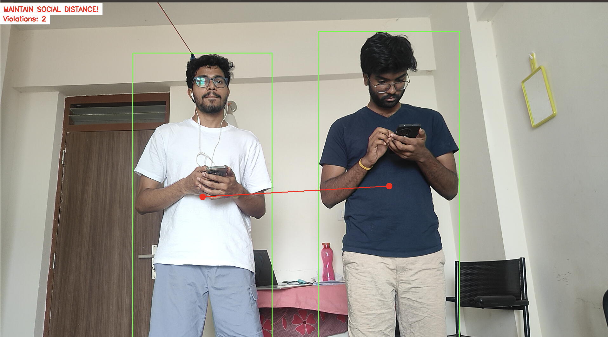
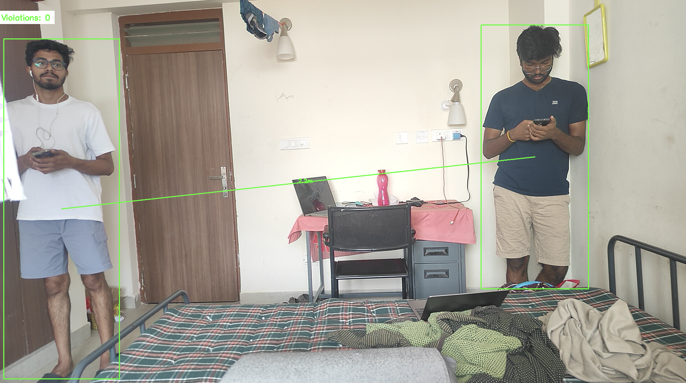

# 🧍‍♂️🧍‍♀️ Social Distancing Detector

A computer vision-based social distancing monitoring system using **YOLOv8** object detection and real-world distance estimation.

 

---

## 📌 Overview

The **Social Distancing Detector** is a machine learning project that uses real-time video analysis to monitor compliance with social distancing guidelines. Using the **YOLOv8** object detection model, the system identifies individuals in a camera feed, calculates real-world distances between them using camera calibration and homography, and detects violations when people are too close to one another.

---

## 🎯 Objectives

- Detect people in a live video feed using a deep learning model.
- Calibrate the camera and convert pixel distances to real-world units (meters).
- Measure pairwise distances between detected individuals.
- Detect and highlight social distancing violations (less than 2 meters).
- Log detection data to an Excel sheet for analysis.
- Provide real-time visual feedback with annotations and violation status.

---

## 🧠 Machine Learning Model

- **Model Used:** [YOLOv8](https://github.com/ultralytics/ultralytics) from Ultralytics
- **Task:** Real-time person detection
- **Framework:** PyTorch (via Ultralytics)

---

## 🛠️ Features

- 📷 **Live video input** from any webcam or IP camera.
- 🧠 **YOLOv8 detection** for fast and accurate person detection.
- 📏 **Homography calibration** for real-world distance estimation.
- 🔴 **Violation detection** with clear visual annotations (bounding boxes and lines).
- 📊 **Excel logging** for offline data analysis.
- ⏱️ **Real-time processing** with frame-by-frame status and distance overlays.

---

## 🔍 Sample Outputs

### ✅ No Violation (Safe Distance Maintained)


### ❌ Violation Detected (Distance < 2 meters)


---

## 📂 Directory Structure

```
├── ek.py                    # Main Python script
├── requirements.txt         # Required dependencies
├── violations.xlsx          # Output Excel data log
├── project_output1.png      # No violation screenshot
├── project_output2.png      # Violation screenshot
```

---

## 📦 Installation

### ✅ Prerequisites

- Python 3.8 or higher
- A webcam or IP camera
- Basic knowledge of Python and command line

### 🔧 Setup

1. Clone the repository:
   ```bash
   git clone https://github.com/your-username/social-distancing-detector.git
   cd social-distancing-detector
   ```

2. Install the dependencies:
   ```bash
   pip install -r requirements.txt
   ```

3. Download YOLOv8 weights (if not already available):
   ```python
   from ultralytics import YOLO
   model = YOLO("yolov8n.pt")
   ```

4. Run the script:
   ```bash
   python ek.py
   ```

---

## 📈 Logged Data (Excel Format)

Each row in the Excel file includes:

- Timestamp
- Total people detected
- Number of violations
- Violation details (e.g., pair indices and distances)
- Average / Min / Max distance between individuals
- Frame processing time (in ms)

---

## 📊 Evaluation Metrics

- **Detection Accuracy:** Quality of YOLOv8 detections under different lighting and backgrounds.
- **Distance Accuracy:** Based on camera calibration, real-world measurements show high accuracy.
- **Processing Speed:** Capable of near real-time performance on most systems.
- **Data Logging:** Reliable tracking and logging without data loss.

---

## 📚 Requirements

From `requirements.txt`:
```text
opencv-python>=4.8.0
numpy>=1.24.0
paho-mqtt>=1.6.1
ultralytics>=8.0.0
pandas>=2.0.0
openpyxl>=3.1.0
```

Install with:
```bash
pip install -r requirements.txt
```

---

## 🚀 Future Improvements

- Add GUI support for configuration and visualization
- Integrate heatmaps and historical trend analysis
- Improve multi-camera support and distributed monitoring
- Deploy as a standalone desktop application

---

## 🤝 Acknowledgments

- [Ultralytics](https://github.com/ultralytics/ultralytics) for YOLOv8
- [OpenCV](https://opencv.org/) for image processing
- Community examples and tutorials that inspired the distance estimation techniques

---

## 📃 License

This project is licensed under the [MIT License](LICENSE).
